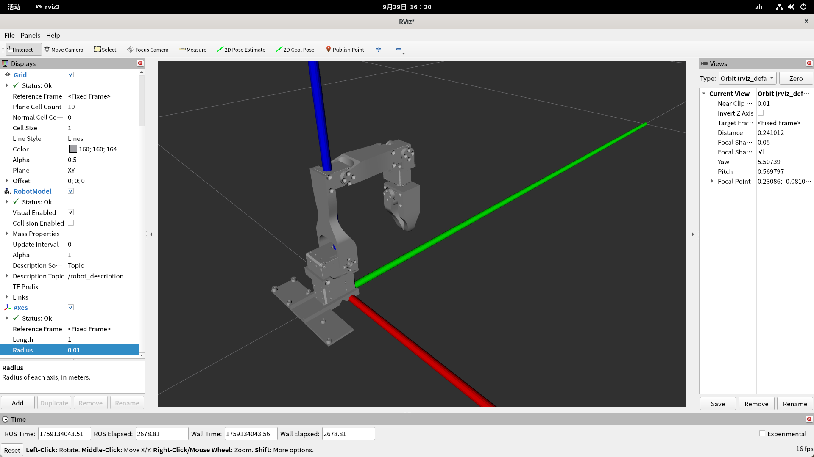

# ROBOARM — 机械臂 + 深度相机 自动采集与控制项目

基于 Piper 机械臂 + Orbbec 深度相机 + YOLO 目标检测，实现自动抓取、分类放置、VLA 数据采集（LeRobot 格式）等功能。

## 目录

- [ROBOARM — 机械臂 + 深度相机 自动采集与控制项目](#roboarm--机械臂--深度相机-自动采集与控制项目)
  - [目录](#目录)
  - [硬件依赖](#硬件依赖)
  - [环境搭建（从零开始）](#环境搭建从零开始)
    - [1. 系统依赖](#1-系统依赖)
    - [2. 安装 uv](#2-安装-uv)
    - [3. 克隆仓库并同步 Python 环境](#3-克隆仓库并同步-python-环境)
    - [4. CAN 总线配置（Piper 机械臂）](#4-can-总线配置piper-机械臂)
      - [4.1 找到真实的 CAN 接口名](#41-找到真实的-can-接口名)
      - [4.2 激活 CAN 接口](#42-激活-can-接口)
      - [4.3 验证 CAN 状态](#43-验证-can-状态)
    - [5. 连通性验证](#5-连通性验证)
    - [6. 灵巧手（LinkerHand O6）环境准备](#6-灵巧手linkerhand-o6环境准备)
  - [配置说明](#配置说明)
    - [config.yaml 关键配置项](#configyaml-关键配置项)
      - [机械臂连接](#机械臂连接)
      - [相机](#相机)
      - [桌面高度](#桌面高度)
      - [物品分类 / YOLO 检测](#物品分类--yolo-检测)
      - [Auto-Reset 参数](#auto-reset-参数)
      - [抓取动作参数](#抓取动作参数)
    - [YOLO 模型准备](#yolo-模型准备)
  - [手眼标定（抓取/采集前必须）](#手眼标定抓取采集前必须)
  - [YOLO 自动分类抓取](#yolo-自动分类抓取)
    - [运行前准备](#运行前准备)
    - [运行方法](#运行方法)
    - [运行行为与退出](#运行行为与退出)
  - [半自动采集数据](#半自动采集数据)
    - [概述](#概述)
    - [工作流程](#工作流程)
    - [使用方法](#使用方法)
      - [1. 修改脚本中的采集参数](#1-修改脚本中的采集参数)
      - [2. 运行采集](#2-运行采集)
      - [3. 启动后的交互](#3-启动后的交互)
    - [键盘控制](#键盘控制)
    - [数据保存与断点续采](#数据保存与断点续采)
    - [头部无显示运行](#头部无显示运行)
  - [VLA 模型推理与部署](#vla-模型推理与部署)
    - [数据格式对齐](#数据格式对齐)
    - [运行步骤](#运行步骤)
    - [关键参数](#关键参数)
  - [其他场景](#其他场景)
    - [物品分类抓取（LLM 视觉识别）](#物品分类抓取llm-视觉识别)
      - [VLM 识别与抓取代码路径](#vlm-识别与抓取代码路径)
      - [运行前配置](#运行前配置)
      - [运行流程](#运行流程)
    - [中国象棋](#中国象棋)
    - [主从臂跟随](#主从臂跟随)
  - [机械臂坐标系](#机械臂坐标系)
    - [2D 手眼标定](#2d-手眼标定)
  - [故障排查](#故障排查)
    - [gs\_usb 内核模块未加载](#gs_usb-内核模块未加载)
    - [CAN 发送失败 / Message NOT sent](#can-发送失败--message-not-sent)
    - [机械臂不响应运动指令](#机械臂不响应运动指令)
    - [相机无画面](#相机无画面)
    - [报错「没有手眼标定数据，无法转换图像坐标」](#报错没有手眼标定数据无法转换图像坐标)
  - [项目结构](#项目结构)
  - [3D 交互式模型查看器（three.js + URDF）](#3d-交互式模型查看器threejs--urdf)

---

## 硬件依赖

| 设备 | 说明 |
|------|------|
| Piper 机械臂 | 通过 USB-CAN 适配器连接，CAN 总线通信 |
| Orbbec 深度相机 | 通过 USB 连接，作为俯视（above）相机，用于目标检测与视觉反馈 |
| Intel RealSense 相机（可选） | 作为腕部（wrist）相机，用于双视角 VLA 数据采集与推理 |
| USB-CAN 适配器 | 连接机械臂与主机 |
| Jetson Orin / 任意 Linux 主机 | 运行控制程序 |

> **相机说明**：数据采集与推理默认使用双相机——Orbbec Gemini 作为俯视相机（`observation/image`），Intel RealSense 作为腕部相机（`observation/wrist_image`）。若只做单相机场景（LLM 抓取、象棋等），仅需 Orbbec 相机。

---

## 环境搭建（从零开始）

### 1. 系统依赖

```bash
sudo apt update
sudo apt install -y can-utils ethtool build-essential
```

**Jetson 上额外需要 gs_usb 内核模块**（USB-CAN 通信必需）：

先检查是否已加载：

```bash
lsmod | grep gs_usb
```

如果没有输出，说明内核未启用 `gs_usb`，需要编译安装。详见文末 [故障排查 / gs_usb 内核模块](#gs_usb-内核模块未加载)。

### 2. 安装 uv

```bash
curl -LsSf https://astral.sh/uv/install.sh | sh
source ~/.bashrc
```

验证：

```bash
uv --version   # 应 >= 0.5.0
```

### 3. 克隆仓库并同步 Python 环境

```bash
# 克隆本仓库
git clone git@github.com:cloud666666666/AIIT-Roboarm.git 
cd ~/roboarm

# 克隆 LeRobot 依赖（我们修改过的版本，与 roboarm 同级或任意位置）
git clone git@github.com:cloud666666666/roboarm-lerobot.git lerobot

# 创建软链接，让 roboarm 能找到 lerobot 源码
# 将源路径替换为你实际克隆 lerobot 的位置
ln -s ~/lerobot ~/roboarm/lerobot

# 回到 roboarm，同步 Python 环境（含 lerobot）
cd ~/roboarm
uv sync

# 验证关键依赖
uv run python -c "from piper_sdk import C_PiperInterface_V2; print('piper_sdk OK')"
uv run python -c "import lerobot; print('lerobot OK:', lerobot.__file__)"
uv run python -c "from ultralytics import YOLO; print('ultralytics OK')"
```

> **说明**：`uv sync` 会根据 `pyproject.toml` 和 `uv.lock` 自动创建 `.venv` 并安装所有依赖（Python 3.10）。
>
> ⚠️ **两条平台路径（本仓库快照不含 `wheels/`、`lerobot/`，直接 `uv sync` 会失败）**：
>
> - **Jetson / aarch64（JetPack 6.1 + CUDA 12.6）**：`pyproject.toml` 通过
>   `[tool.uv.sources]` 指向 NVIDIA 官方 torch 轮子
>   `wheels/torch-2.5.0a0+872d972e41.nv24.8-cp310-cp310-linux_aarch64.whl` 与本机源码构建的
>   `wheels/torchvision-0.20.0-cp310-cp310-linux_aarch64.whl`（**构建步骤见 pyproject.toml 内注释**），
>   另有 `stubs/torchcodec`。这些文件体积大、未随仓库分发，需自行准备并放到对应路径，
>   `uv sync` 才能解析；缺 `lerobot/`（`[tool.uv.sources]` 里的本地源，克隆方式见上一步）同样会报
>   `error: Distribution not found at: file:///…/lerobot`。
> - **x86_64 + PyPI torch（开发机更省事）**：把 `[tool.uv.sources]` 里的 `torch`/`torchvision`/`torchcodec`
>   三个本地路径项与 `[tool.uv]` 的 `constraint-dependencies`/`environments` 一并去掉（那些只服务 Jetson），
>   再 `uv sync`，torch 直接从 PyPI 解析。
>
> 只想先把机械臂/灵巧手跑起来、不想折腾 torch：可以只补装少量运行时包，例如
> `uv pip install pymodbus==3.5.1`（灵巧手 Modbus）与 `uv pip install piper-sdk kinpy scipy`，
> 不需要 `uv sync` 全量安装。

### 4. CAN 总线配置（Piper 机械臂）

#### 4.1 找到真实的 CAN 接口名

```bash
source .venv/bin/activate

SDK_DIR=$(python - <<'PY'
import inspect, os, piper_sdk
print(os.path.dirname(inspect.getfile(piper_sdk)))
PY
)

bash "$SDK_DIR/find_all_can_port.sh"
```

示例输出：

```
Interface can_piper is connected to USB port 1-4.2:1.0
```

> 记下输出中的 **接口名**（如 `can_piper`、`can4`）和 **USB 地址**（如 `1-4.2:1.0`）。

#### 4.2 激活 CAN 接口

```bash
CAN_IF="can_piper"    .
    # 替换为上一步的实际接口名
USB_ADDR="1-4.2:1.0"      # 替换为上一步的实际 USB 地址

sudo ip link set "$CAN_IF" down 2>/dev/null || true
bash "$SDK_DIR/can_activate.sh" "$CAN_IF" 1000000 "$USB_ADDR"
```

> **注意**：波特率固定为 `1000000`，不要填成 `100000`。

#### 4.3 验证 CAN 状态

```bash
ip -details link show "$CAN_IF"
```

应看到接口处于 `UP` 状态，波特率为 `1000000`。

### 5. 连通性验证

复制配置文件并修改：

```bash
cp config.yaml.example config.yaml
```

编辑 `config.yaml`，将 `arm_type` 改为 `piper`，`arm_port` 改为实际的 CAN 接口名（如 `can_piper` 或 `can4`）。

```bash
# 只读连通性测试
uv run python arm/calibrate_offset.py
```

如果能打印当前关节角度/末端位姿，说明 CAN 通信正常。

```bash
# 运动测试
uv run python arm/piper_ctrl_by_sdk.py
```

机械臂应能进行使能并执行测试运动。

---

### 6. 灵巧手（LinkerHand O6）环境准备

灵巧手 SDK 以 **git submodule** 形式随仓库（`third_party/linkerhand-python-sdk`），
上游：<https://github.com/linker-bot/linkerhand-python-sdk>，锁定的提交为
`0cc0585b97214b2cc4a9a5afcc84aee9f414e0e8`（2026-08-11，SDK 自带版本号 3.1.1，支持 O6/L6 的 RS485 模式）。

```bash
# 克隆时一并拉取（仓库里还有 chess/MyChess、sim/isaac-sim 两个 submodule）
git clone --recurse-submodules <repo-url>
# 已经克隆过：初始化全部或只初始化 SDK
git submodule update --init --recursive
git submodule update --init third_party/linkerhand-python-sdk

# 本机无法直连 GitHub 时，让 git 走代理（一次性配置）
git config --global url."https://v4.gh-proxy.org/https://github.com/".insteadOf "https://github.com/"
```

**让 Python 找到 SDK（二选一）**：

1. **推荐**：`config.yaml` 里设置 `linker_hand_sdk_path: <仓库>/third_party/linkerhand-python-sdk`，
   `arm/linker_hand.py` 会把该目录插入 `sys.path` 后再 `from LinkerHand.linker_hand_api import LinkerHandApi`；
2. 或设环境变量：`export PYTHONPATH=$PWD/third_party/linkerhand-python-sdk:$PYTHONPATH`。

> ⚠️ SDK **没有** `setup.py` / `pyproject.toml`，所以 **不能** `pip install -e third_party/linkerhand-python-sdk`
> （会报“找不到构建配置”）——只能用上面的 `linker_hand_sdk_path` 或 `PYTHONPATH` 方式。
>
> 🔧 **重要：上游 SDK 与本仓库有 `utils` 包名冲突，必须打补丁**。上游 SDK 内部用裸包名导入
> （`from utils.mapping import *`、`from core.rs485...`），而本仓库根目录**也有自己的 `utils/` 包**；
> 从仓库根运行脚本时（如 `python3 linker_hand_fist.py`）`utils` 会先解析到本仓库的 `utils`，
> 实测报错：`ModuleNotFoundError: No module named 'utils.mapping'`（把 SDK 根目录放在 `sys.path` 最前也无效，
> 因为冲突的是顶级名 `utils` 本身）。解决办法是把 SDK 内部的 `utils.*` / `core.*` 改成
> `LinkerHand.utils.*` / `LinkerHand.core.*`（等价重构、不改行为）：仓库已附带补丁文件，
> **一行应用**（只改 submodule 的工作区，不产生新提交）：
>
> ```bash
> git -C third_party/linkerhand-python-sdk apply ../linkerhand-imports.patch
> ```
>
> 该补丁针对当前 submodule 提交 `0cc0585` 生成；上游更新后可能需重做。
> 更省事、可复现的做法：把补丁提交到你自己的 **fork**，再把 `.gitmodules` 的 URL 与 submodule
> 指纹指向该 fork（推荐长期方案）。
> （开发机上的 `/home/czn/linkerhand-python-sdk` 已打好同一补丁，`config.yaml` 的
> `linker_hand_sdk_path` 指向它即可直接工作。）

**依赖**：灵巧手 Modbus RTU 链路需要 **`pymodbus==3.5.1`**（SDK 的 `requirements.txt` 即固定此版本；
它会带上 `pyserial`）与 **PyYAML**（读 SDK 的 `LinkerHand/config/setting.yaml`）。已在
`pyproject.toml` 的 `dependencies` 中声明；CAN 模式额外需要 `python-can`（本项目已声明），Modbus 模式不需要。

> `uv.lock` **未随本次改动重新生成**：本仓库快照里 `lerobot/`、`wheels/` 等本地源不存在，
> `uv lock` 会在 `lerobot` 处直接报 `error: Distribution not found at: file:///…/lerobot`。
> 因此需要时请手工装：`uv pip install pymodbus==3.5.1`（或 `pip install pymodbus==3.5.1`）。

**Modbus（RS485）串口准备**：

```bash
ls /dev/serial/by-id/        # 推荐：by-id 名稳定，填这个
ls /dev/ttyUSB*              # 简易：多个转接器时序号可能漂移
dmesg | tail -20             # 插入 USB-485 转接器后看内核识别到哪个口
```

- `config.yaml` 的 `linker_hand_modbus` 填真实设备名（SDK 的 `config/setting.yaml` 里
  `RIGHT_HAND.MODBUS` 目前也是 `/dev/ttyUSB0`，可互相对照）；
- **波特率 115200 / 8N1 由 SDK 固定**（`linker_hand_api.py` 构造时硬编码，无配置项）；
- 从站地址由 `linker_hand_type` 决定：**右手 0x27(39)、左手 0x28(40)**；
- 权限：`sudo chmod 777 /dev/ttyUSB0` 或把用户加入 `dialout` 组（SDK 文档写 777）。

**验证（仅显式运行脚本时才发帧；请先应用上面的导入补丁，否则会报 `No module named 'utils.mapping'`）**：

```bash
# 先确认补丁已应用（无输出即已应用）
git -C third_party/linkerhand-python-sdk diff --quiet && echo "尚未打补丁" || echo "补丁已应用"

uv run python linker_hand_open.py --hold 2     # 张开，保持 2 秒
uv run python linker_hand_fist.py --hold 2     # 握拳，保持 2 秒
# 两者都会打印：下发姿态值 + 来源（config 覆盖还是内置默认）+ 通信链路（Modbus/CAN），
# 并在保持后回读关节位置，便于确认是否到位。
```

> 提醒：O6 **右手握拳值**官方 SDK 未定义（`O6_positions.yaml` 的 RIGHT_HAND 只有「张开」），
> 内置默认取官方通用示例 `[102,18,0,0,0,0]`，**待实机验证**；不满意时用 config
> `linker_hand_fist_pose` 覆盖（优先微调第 1、2 个分量），无需改代码。

## 配置说明

所有运行配置集中在项目根目录的 `config.yaml` 中（复制自 `config.yaml.example`）。

### config.yaml 关键配置项

#### 机械臂连接

```yaml
arm_port: can4          # Piper 为 can*，Lerobo 为 COM*
arm_type: piper         # piper 或 lerobo
arm_offset: [0, -30, -40, -50, 0]  # 关节零位偏移，单位度
arm_move_speed: 50      # 运动速度百分比 1-100，值越小越慢越平稳
arm_reach_mse_threshold_deg2: 1.0  # 到位判定阈值（关节角均方误差，单位平方度）
get_arm_angles_retry_times: 3      # 读取舵机角度的重试次数
```

#### 相机

```yaml
camera_ip: ""           # 留空使用本地 Orbbec 相机；填写 IP 则使用远程相机
camera_port: 8084       # 远程相机端口
cv2_headless_port: 8079 # Web 显示端口（无显示器环境），留空则使用 OpenCV 窗口
```

#### 桌面高度

```yaml
default_desktop_height: 0.135  # 机械臂坐标系下桌面 Z 坐标，单位米
```

#### 物品分类 / YOLO 检测

```yaml
classification_YOLO_model_path:
  - /home/user/roboarm/object_detect/runs/best.pt  # YOLO OBB 模型路径
default_conf_thres: 0.5     # 检测置信度阈值
default_gripper_close_threshold: 0.05  # 夹爪闭合阈值

# 各类别抓取与放置配置
class_pos:
  default:                  # 默认配置（匹配不到的类别使用此项）
    pos: [0.05, 0.45]       # 放置位置 (x, y)，单位米
    random_pos:             # auto-reset 随机撒回范围 [[x_min,x_max],[y_min,y_max]]
      - [0.0, 0.5]
      - [-0.2, 0.3]
  potato:
    pos: [0.05, 0.4]
    random_pos:
      - [0.0, 0.16]
      - [-0.2, 0.3]
  tomato:
    pos: [0.05, 0.4]
    random_pos:
      - [0.17, 0.33]
      - [-0.2, 0.3]
  carrot:
    pos: [0.05, 0.4]
    random_pos:
      - [0.34, 0.5]
      - [-0.2, 0.3]
```

#### Auto-Reset 参数

> 以下参数（含上方 `class_pos.*.random_pos`）仅供全自动复位脚本 `record_and_auto_reset.py` 使用。该全自动方案实测行不通，实际采集用[半自动方案](#半自动采集数据)（人工摆放物体），这些参数可忽略。

```yaml
workspace_x_range: [-0.1, 0.55]   # 工作空间 X 范围，超出会拒绝
workspace_y_range: [-0.3, 0.55]   # 工作空间 Y 范围
reset_min_place_dist_m: 0.20      # 随机放置时离已有物体的最小距离
reset_max_objects_per_cycle: 1    # 每轮最多撒回物体数
```

#### 抓取动作参数

```yaml
catch_raise_height: 0.1   # 抓取前抬起高度，单位米
place_raise_height: 0.1   # 放置前抬起高度，单位米
catch_time_interval_s: 0.5 # 抓取动作间停顿，单位秒
catch_offset: 0.00         # 夹爪前向偏移，单位米
go_down_before_open_gripper_in_place: true  # 放置时先下降再松爪
```

### YOLO 模型准备

项目使用 YOLO OBB（Oriented Bounding Box）模型进行目标检测。

- 训练脚本：`object_detect/train.py`
- 标注数据工具：`object_detect/dataset_process/`（含拍照脚本和 LabelMe JSON 转 YOLO 标签工具）
- 预训练模型放在 `object_detect/runs/` 目录下

如果需要训练自己的模型：

1. 用 `object_detect/dataset_process/get_pic.py` 拍摄目标物体图片
2. 用 LabelMe 标注（OBB 旋转框）
3. 用 `object_detect/dataset_process/json2label.py` 转换为 YOLO 格式
4. 运行 `object_detect/train.py` 训练

---

## 手眼标定（抓取/采集前必须）

> ⚠️ **这一步不可跳过**。YOLO 自动抓取和数据采集都依赖 2D 手眼标定：程序用它把相机像素坐标 `(u, v)` 转换成机械臂平面坐标 `(x, y)`（见 [arm/arm_base.py:469](arm/arm_base.py#L469) 的 `pixel2pos`）。标定矩阵保存在 `arm/hand-eye-data/2d_homography.npy`，而该目录已被 `.gitignore` 忽略——**克隆后是空的，必须自己标定生成**，否则抓取/采集运行时会报 `没有手眼标定数据，无法转换图像坐标`。

标定脚本为 `arm/calibrate_handeye_2d.py`，支持两种模式：

```bash
# 方式 A：手动采点（在相机画面上点击 → 拖动机械臂末端到该点 → 记录，重复 4+ 个点）
uv run python arm/calibrate_handeye_2d.py --mode calibrate


# 方式 B：测试已有标定（复用 2d_homography.npy，点击画面验证映射是否准确）
uv run python arm/calibrate_handeye_2d.py --mode test
```

标定完成后会在 `arm/hand-eye-data/` 生成 `2d_homography.npy`（以及 `2d_image_points.npy`、`2d_end_poses.npy` 等中间数据）。`calibrate` 模式采点结束后会打印重投影误差，误差越小标定越准，建议内点平均误差在毫米级。

标定要点：

- 相机与机械臂的相对位置一旦改变，必须重新标定
- 标定时机械臂末端和点击点应尽量落在同一桌面高度平面（`default_desktop_height`）
- 采点尽量覆盖整个工作空间，避免全部集中在一小块区域


---

## YOLO 自动分类抓取

`classification/catch_with_arm.py` 使用 Orbbec 俯视相机和 YOLO OBB 模型持续检测物体，将目标的图像坐标通过 2D 手眼标定转换为机械臂坐标，然后自动抓取并放到 `config.yaml` 中配置的位置。

### 运行前准备

1. 完成 [环境搭建](#环境搭建从零开始)，确保 Piper、Orbbec 相机和 YOLO 依赖可用。
2. 完成 [2D 手眼标定](#手眼标定抓取采集前必须)。
3. 在 `config.yaml` 中至少确认以下配置：
   - `classification_YOLO_model_path`：YOLO OBB 权重路径，可配置多个模型。
   - `default_conf_thres`：检测置信度阈值。
   - `place_pos.<类别>.pos`：各类别的放置坐标；未配置时会放回目标原位置。
   - `place_distance_threshold`：目标距放置点小于该距离时跳过，防止重复抓放。
   - `catch_offset`：抓取点沿夹爪方向的偏移量。

`place_pos.<类别>.pos` 的两个坐标既可使用米为单位的数值，也可使用 `x`、`-x`、`y`、`-y` 引用目标物体的坐标。例如：

```yaml
place_pos:
  carrot:
    pos: [x, -y]
```

### 运行方法

默认只抓取 `carrot` 类别：

```bash
uv run python classification/catch_with_arm.py
```

指定其他 YOLO 类别名：

```bash
uv run python classification/catch_with_arm.py --target tomato
```

脚本会在指定类别的检测结果中选择置信度最高的物体。当前命令行参数默认值为 `carrot`；如果需要不限定类别、直接选择所有检测结果中置信度最高的物体，可在 Python 中调用 `main(target_class=None)`。

### 运行行为与退出

- 程序启动后，机械臂先回到 Home 位，随后持续检测、抓取和放置目标。
- 检测画面会显示 OBB 框、类别、置信度和 FPS。
- 按 `Esc` 或在终端按 `Ctrl+C` 退出；退出时机械臂会回到 Home 位，并关闭机械臂连接和相机。
- 该脚本会真实驱动机械臂。首次运行时建议降低 `arm_move_speed`，确认放置坐标和工作空间安全，并随时准备急停。

---

## 半自动采集数据

### 概述

`classification/catch_with_arm_record_piper.py` 是半自动 VLA 数据采集脚本：**录制阶段全自动**（YOLO 检测 → 机械臂抓取 → 放入收集箱 → 保存为 LeRobot 格式数据），**每轮之间的复位由人工手动完成**（重新摆放抓取物体的位置，摆好后按键进入下一轮）。

> **为什么是半自动**：项目里还有一个全自动流水线 `record_and_auto_reset.py`，尝试让机械臂自己把物体重新摆到随机位置来创造新场景，但实测行不通（复位不稳定），因此实际采集改用本节的半自动方案——机械臂只负责录制阶段的抓取，物体摆放交给人工。

### 工作流程

```
┌─ Episode N ──────────────────────────────────────┐
│                                                   │
│  1. Recording Phase (录制，全自动)                 │
│     ├─ 相机持续拍摄                                 │
│     ├─ YOLO 检测目标物体                            │
│     ├─ 机械臂移动到目标位置抓取                       │
│     ├─ 放入收集箱                                   │
│     └─ 自动保存 MP4 + 关节状态到 LeRobot 数据集      │
│                                                   │
│  2. Reset Phase (复位，人工)                       │
│     ├─ 画面提示 "RESET - Press Right arrow ..."    │
│     ├─ 人工重新摆放抓取物体的位置                     │
│     └─ 摆好后按右箭头 / n 进入下一轮                  │
│                                                   │
│  3. 循环直到 NUM_EPISODES 完成                      │
│                                                   │
└───────────────────────────────────────────────────┘
```

### 使用方法

#### 1. 修改脚本中的采集参数

编辑 `classification/catch_with_arm_record_piper.py` 顶部配置区：

```python
DATASET_ROOT = "/home/user/dataset/piper_yolopick"  # 数据集保存路径
NUM_EPISODES = 1000       # 总共采集的 episode 数量
FPS = 30                  # 采集帧率
EPISODE_TIME_S = 6000     # 单个 episode 最长录制时长（秒），一般靠按键提前结束
RESUME = True             # True=断点续采, False=从头开始（目标目录已存在则报错）
TARGET_CLASS_LIST = ["carrot", "potato", "tomato"]  # 目标类别列表，按 episode 逐轮轮换
```

> **数据格式**：采集的观测为 7 维状态 `[joint_1..6 (deg), gripper_0to1 * 100]`，动作空间相同；图像包含俯视相机 `observation/image`（Orbbec）与腕部相机 `observation/wrist_image`（RealSense）。此格式与 VLA 推理客户端 `classification/main.py` 严格对齐。

#### 2. 运行采集

```bash
uv run python classification/catch_with_arm_record_piper.py
```

#### 3. 启动后的交互

程序启动后会打印数据保存路径和键盘快捷键：

```
开始录制，数据保存到 /home/user/dataset/piper_yolopick
操作方式：
  n/右箭头 -> 结束当前 episode
  r/左箭头 -> 丢弃当前 episode 并重录
  q/Esc    -> 停止录制
```

### 键盘控制

| 按键 | 功能 |
|------|------|
| `n` / `→`（右箭头） | 结束当前 episode，保存数据；在复位阶段则表示"已摆好，进入下一轮" |
| `r` / `←`（左箭头） | 丢弃当前 episode（不保存），重新录制 |
| `q` / `Esc` | 停止采集，保存当前数据后退出 |

> **复位交互**：一个 episode 录完后，画面会显示 `RESET - Press Right arrow when ready`。此时人工把抓取物体重新摆到合适位置，摆好后按 `n` / 右箭头即开始下一轮录制。

### 数据保存与断点续采

- 数据以 **LeRobot 格式** 保存在 `DATASET_ROOT` 目录
- 每个 episode 包含：MP4 视频（H.264）、关节状态序列（parquet）
- 视频编码在后台异步进行，不阻塞采集
- **`RESUME = True`** 时，重启程序会自动检测已有 episode 数量，从断点继续
- 异常退出时，程序会尝试保存当前 episode 的已录制部分
- **`RESUME = False`** 时，如果目标目录已存在则报错

### 头部无显示运行

项目支持在无显示器（headless）的 Jetson 上运行。在 `config.yaml` 中设置：

```yaml
cv2_headless_port: 8079
```

启动程序后，在浏览器中访问 `http://<jetson-ip>:8079/?window=Recording` 即可实时查看相机画面和检测结果。

> 启动 Flask 服务器需要约 2-5 秒（Jetson 上较慢），程序会在启动时预热显示。

---

## VLA 模型推理与部署

采集完数据并训练出 VLA 策略后，用 `classification/main.py` 在真机上做闭环推理。它连接 [openpi](https://github.com/Physical-Intelligence/openpi) 策略服务器，发送相机图像 + 机械臂状态，接收动作序列并下发到 Piper 机械臂。

### 数据格式对齐

推理客户端的观测/动作格式与训练录制器 `catch_with_arm_record_piper.py` **严格一致**：

| 字段 | 含义 |
|------|------|
| `observation/state` | `[joint_1..6 (deg), gripper_0to1 * 100]`，7 维 |
| `action` | 同 state 的 7 维空间（绝对关节角度 + 夹爪 * 100） |
| `observation/image` | 俯视相机（Orbbec），RGB HxWx3 |
| `observation/wrist_image` | 腕部相机（Intel RealSense），RGB HxWx3 |

### 运行步骤

1. **启动策略服务器**（在训练机 / GPU 机器上，需先安装 openpi）：

   ```bash
   # openpi 项目内，加载训练好的 pi05_piper 权重
   python scripts/serve_policy.py --port 8002
   ```

2. **在 Piper 主机上安装 openpi 客户端依赖**（装入 roboarm 的 venv）：

   ```bash
   uv pip install -e /home/user/openpi/packages/openpi-client
   ```

3. **先干跑（dry-run）验证**——只打印动作、不驱动机械臂：

   ```bash
   uv run python classification/main.py --host <策略服务器IP> --port 8002 --dry_run
   ```

4. **真机推理**：

   ```bash
   uv run python classification/main.py \
     --host <策略服务器IP> --port 8002 \
     --prompt "pick the carrot toy and place into box"
   ```

### 关键参数

| 参数 | 默认 | 说明 |
|------|------|------|
| `--host` / `--port` | `<policy-server-ip>` / `8002` | 策略服务器地址 |
| `--prompt` | pick the carrot ... | 任务指令，需与训练时的措辞风格一致 |
| `--actions_per_chunk` | 10 | 每次推理执行的动作步数，越小闭环越紧（网络往返更多） |
| `--control_dt` | 0.033 | 相邻动作下发间隔（≈ 1/30s，与训练帧率对齐） |
| `--move_speed` | 100 | 启动归零 / 控制模式速度百分比 |
| `--dry_run` | False | 只记录动作不驱动机械臂，首次运行务必先开启 |

> **安全提示**：首次部署或更换权重后，务必先用 `--dry_run` 确认动作合理，并适当降低 `--move_speed`，再进行真机运动。推理时机械臂会以接近开环方式执行模型输出的密集轨迹，请确保工作空间内无人无障碍。

---

## 其他场景

### 物品分类抓取（LLM 视觉识别）

使用 VLM（视觉语言模型）同时分析相机画面和自然语言指令，定位目标物体，转换为机械臂坐标后完成抓取与分类放置。

#### VLM 识别与抓取代码路径

| 路径 | 作用 |
|------|------|
| `llm/catch_by_llm.py` | 主入口；读取相机画面和文字/语音指令，调用 VLM，并执行抓取、放置和成功率统计 |
| `llm/llm_detect.py` | 图像编码、相机方向修正、VLM 检测请求及检测结果聚合 |
| `llm/llm_api.py` | OpenAI 兼容多模态接口客户端，读取模型地址、模型名和提示词配置 |
| `prompts.toml` | `user_instruction_prompt` 等 VLM 提示词模板 |
| `arm/arm_base.py` | 像素坐标转换、夹爪角度计算以及 `catch_and_place()` 抓放动作 |
| `llm/fine_tuing/` | VLM 数据标注、微调、LoRA 合并、部署和评测脚本；详见该目录下的 `README.md` |

调用链如下：

```text
llm/catch_by_llm.py
  → llm/llm_detect.py
  → llm/llm_api.py + prompts.toml
  → VLM 返回目标边界框
  → arm/arm_base.py: pixel2pos() / catch_and_place()
```

#### 运行前配置

1. 完成上文的 [2D 手眼标定](#手眼标定抓取采集前必须)，确保存在 `arm/hand-eye-data/2d_homography.npy`。
2. 根据 `config.yaml.example` 配置以下字段：

```yaml
# OpenAI 兼容的 VLM 服务
llm_base_url: http://<VLM服务IP>:<端口>/v1
llm_api_key: any                  # 本地服务也不能留空
llm_model: output/merged-qwen3.5-9b-graspdet
prompts_file: prompts.toml

# 相机画面是否需要旋转 180°；主要影响左右、远近等空间判断
RotationCam2Arm: true

# 各类别的放置位置及匹配关键词
place_pos:
  red:
    pos: [0.1, 0.2]
    keywords: ["red", "红色"]

# 抓取点沿夹爪方向的补偿距离，单位米
catch_offset: 0.00
```

`llm_base_url` 必须提供 OpenAI 兼容的 `/chat/completions` 多模态接口。使用仓库内微调模型时，可参考 `llm/fine_tuing/README.md` 和 `llm/fine_tuing/serve_vllm.sh` 启动本地服务。

#### 运行流程

当前脚本默认执行 `catch_by_text_instruction()`，指令列表定义在 `llm/catch_by_llm.py` 的 `instructions` 变量中。按需修改指令后运行：

```bash
uv run python llm/catch_by_llm.py
```

程序会依次执行：

1. Orbbec 相机采集彩色画面。
2. 将画面与自然语言指令发送给 VLM。
3. VLM 返回目标类别、中心坐标、宽高和旋转信息。
4. 使用 2D 手眼标定将目标像素坐标转换为机械臂平面坐标。
5. 根据 `place_pos` 的关键词匹配放置区域，执行抓取与放置。
6. 将本次结果写入 `llm/catch_stats.json`；按 `Esc` 退出并使机械臂回到 Home 位。

如需使用麦克风语音指令，将脚本末尾的 `catch_by_text_instruction()` 改为 `catch_by_audio()`，并配置 `audio2text_backend` 及对应语音识别服务参数。

### 中国象棋

YOLO 识别棋子 → 机械臂自动走棋：

```bash
uv run python chess/catch_and_place.py
```

### 主从臂跟随

Leader-Follower 遥操作：

```bash
uv run python leader_follower/leader_follower.py
```

---

## 机械臂坐标系

以最下面的舵机为原点，红色为 X 轴，绿色为 Y 轴，蓝色为 Z 轴。



### 2D 手眼标定

相机像素坐标到机械臂基座坐标系的映射由 2D 手眼标定得到，是 YOLO 抓取/采集的前置步骤。完整流程和三种标定模式见上文 [手眼标定（抓取/采集前必须）](#手眼标定抓取采集前必须)。

---

## 故障排查

### gs_usb 内核模块未加载

**现象**：`lsusb` 能看到 USB-CAN 设备，但 `ip link show | grep can` 看不到 CAN 接口；SDK 报 `SEND_MESSAGE_FAILED (100017)`。

**原因**：内核未编译 `gs_usb` 模块（Jetson 默认内核常见）。

**解决**（Jetson）：

```bash
# 检查
zcat /proc/config.gz | grep GS_USB
# 如果输出 "# CONFIG_CAN_GS_USB is not set"，则需要编译

# 1. 安装编译依赖
sudo apt install -y build-essential bc kmod flex bison libncurses-dev libssl-dev dwarves wget git

# 2. 获取与当前 uname -r 完全匹配的 Jetson 内核源码
# 3. 在源码目录执行：
zcat /proc/config.gz > .config
sed -i 's/CONFIG_LOCALVERSION=""/CONFIG_LOCALVERSION="-tegra"/' .config
make olddefconfig

export LOCALVERSION=-tegra
export IGNORE_PREEMPT_RT_PRESENCE=1
make -j$(nproc) modules

# 4. 安装
sudo mkdir -p /lib/modules/$(uname -r)/kernel/drivers/net/can/usb
sudo cp drivers/net/can/usb/gs_usb.ko /lib/modules/$(uname -r)/kernel/drivers/net/can/usb/
sudo depmod -a
sudo modprobe gs_usb

# 5. 设置开机自动加载
echo "gs_usb" | sudo tee /etc/modules-load.d/gs_usb.conf
```

### CAN 发送失败 / Message NOT sent

**恢复流程**：

```bash
CAN_IF="can_piper"   # 改成你的实际接口名

# 1. 关闭接口
sudo ip link set "$CAN_IF" down 2>/dev/null || true

# 2. 卸载驱动
sudo modprobe -r gs_usb

# 3. 物理拔掉 USB-CAN，等待 3 秒后重新插入
# 4. 机械臂断电再上电

# 5. 重新加载驱动
sudo modprobe gs_usb

# 6. 重新确认接口名并激活
ls /sys/class/net | grep can
sudo ip link set "$CAN_IF" type can bitrate 1000000
sudo ip link set "$CAN_IF" txqueuelen 1000
sudo ip link set "$CAN_IF" up
```

### 机械臂不响应运动指令

- 确认机械臂处于 **slave 模式**（非 master 模式），否则需重启臂体
- `judge_flag=False` 适用于第三方 USB-CAN 适配器
- 先跑 `arm/calibrate_offset.py` 验证连通性，再跑运动脚本

### 相机无画面

- 确认 Orbbec 相机 USB 已连接
- 确认 `camera_ip` 为空（使用本地相机）或填写了正确的远程相机 IP
- 检查 udev 规则是否已安装：`camera/scripts/` 中有 Orbbec 设备的 udev 配置文件

### 报错「没有手眼标定数据，无法转换图像坐标」

**原因**：`arm/hand-eye-data/2d_homography.npy` 不存在。该目录被 `.gitignore` 忽略，克隆后需自行标定生成。

**解决**：先执行 [手眼标定（抓取/采集前必须）](#手眼标定抓取采集前必须)，生成标定矩阵后再运行抓取/采集脚本。

---

## 项目结构

```
roboarm/
  arm/              # 机械臂控制（Piper + Lerobo），手眼标定
  camera/           # Orbbec 深度相机 + USB 相机控制
  classification/   # YOLO 自动抓取 + 数据采集流水线 + VLA 推理客户端(main.py)
  object_detect/    # YOLO OBB 模型训练与检测
  llm/              # LLM 视觉识别与指令理解
  chess/            # 中国象棋场景
  leader_follower/  # 主从臂遥操作
  sim/              # Isaac Sim / MuJoCo 仿真
  utils/            # 配置读取，无头显示
  urdf/             # 机械臂 URDF 模型
  config.yaml       # 运行时配置
  prompts.toml      # LLM 提示词模板
```

---

## 3D 交互式模型查看器（three.js + URDF）

`docs/viewer/` 是一个**纯静态**的整机 3D 查看器（不连接机械臂/灵巧手），用于离线核对 URDF、
关节限位与抓取姿态：

- `docs/viewer/index.html`：查看器页面（three.js + URDFLoader，依赖已本地 vendor，无需联网）
- `docs/viewer/robot.urdf`：整机 URDF（Piper 7 段 + LinkerHand O6 左手 12 段；mesh 改为相对路径 `meshes/*.stl`）
- `docs/viewer/meshes/`：精简后的网格（原 22 MB → 约 5.7 MB；用 trimesh 二次误差简化面片，保留外形）

功能：轨道旋转/平移/缩放、6 个机械臂关节滑条（度）、6 个灵巧手驱动滑条（O6 值 0–255）、
预设按钮（手：张开 `[255,70,255,255,255,255]` / 握拳 `[102,18,0,0,0,0]`；臂：初始 /
平抓姿态 `J1~J4=[-3.87,90.29,-7.66,0.76]°、J5=-69.0°、J6=6.75°`）、相机预设、深色主题、中文界面。

### 本地查看

浏览器出于同源策略不能直接打开 `file://` 下的 URDF/mesh，需起静态服务（任选其一）：

```bash
# 在仓库根目录
python3 -m http.server 8000
# 然后浏览器访问
#   http://localhost:8000/docs/viewer/index.html     （查看器）
#   http://localhost:8000/docs/index.html            （文档落地页）
```

### GitHub Pages 开启方式与访问 URL

仓库已带 `.nojekyll`，Pages 直接托管 `docs/` 目录即可：

1. 打开仓库 **Settings → Pages**；
2. **Build and deployment → Source** 选 `Deploy from a branch`；
3. **Branch** 选 `main`（或默认分支）、目录选 **`/docs`**，保存；
4. 等 1–2 分钟，访问：

```
https://cloud666666666.github.io/piper-with-linkerhand/            # 文档落地页
https://cloud666666666.github.io/piper-with-linkerhand/viewer/index.html   # 3D 查看器
```

> 注：页面里的模型与 three.js 均为同目录相对路径，Pages 上无需任何额外配置或 CDN。
